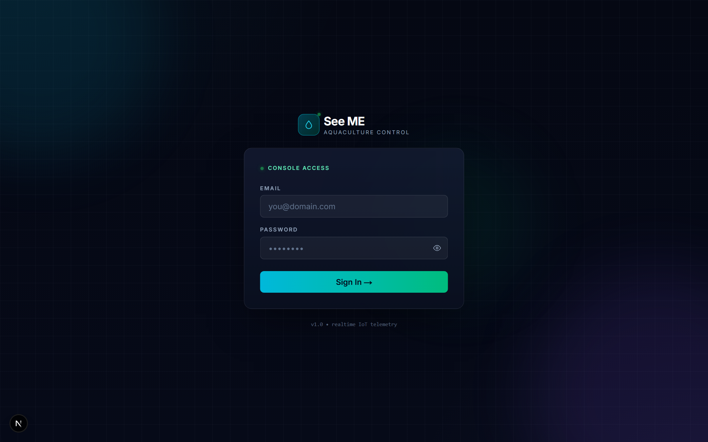
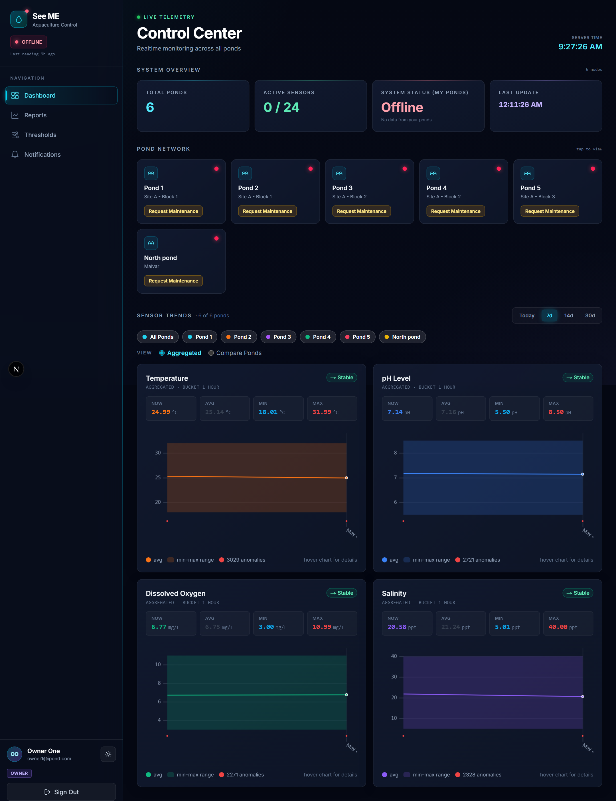
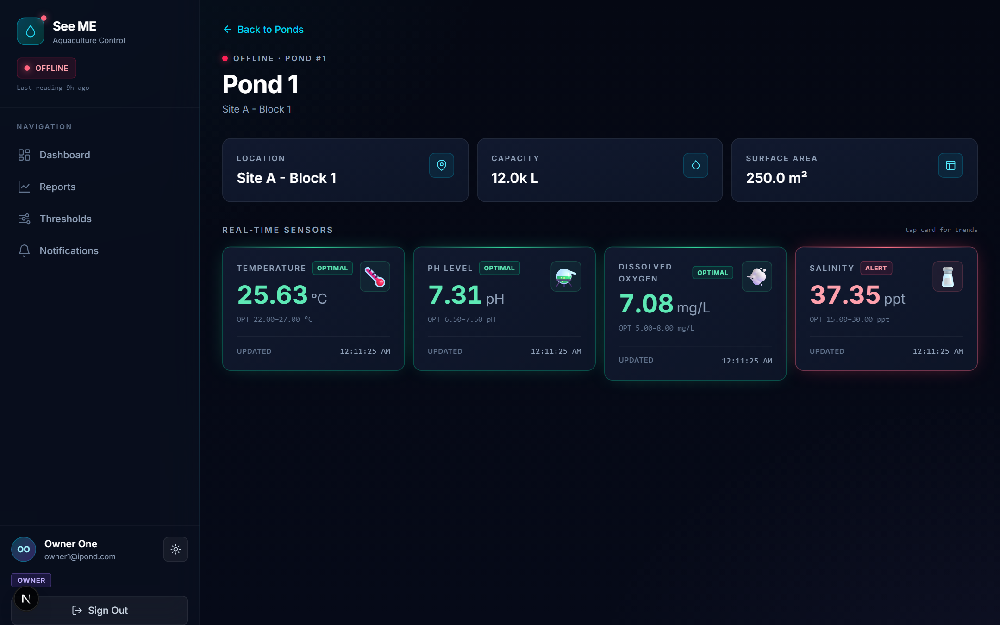
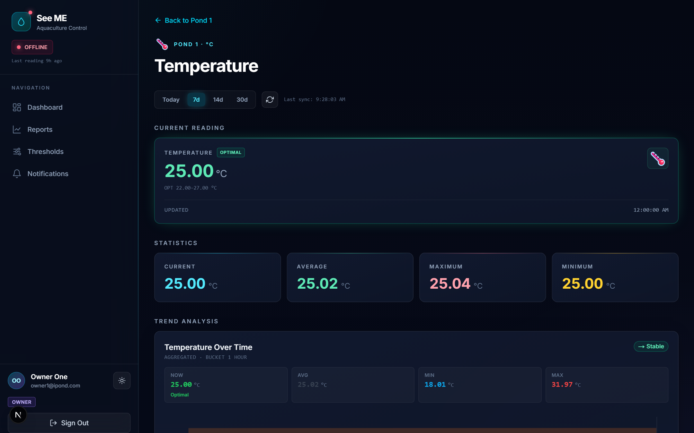
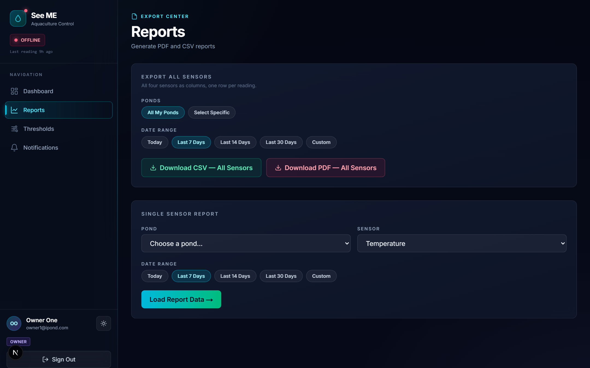
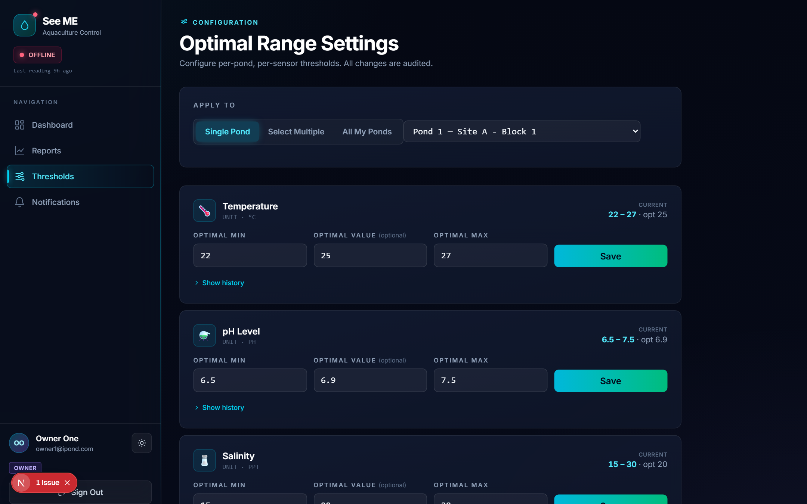
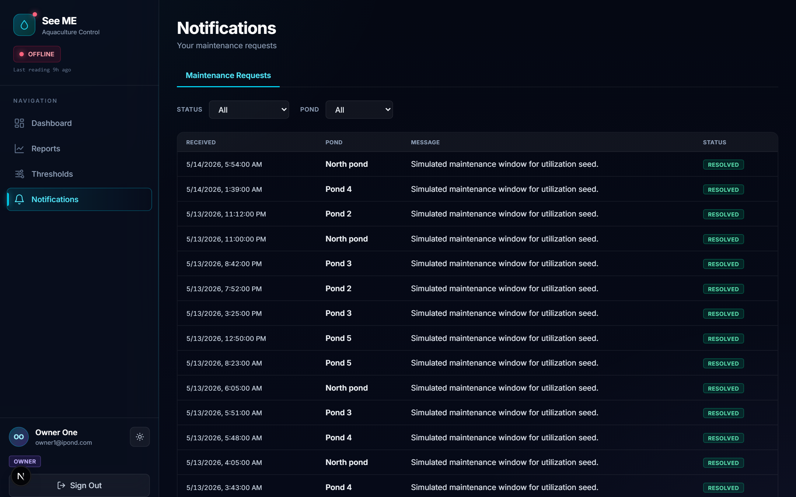
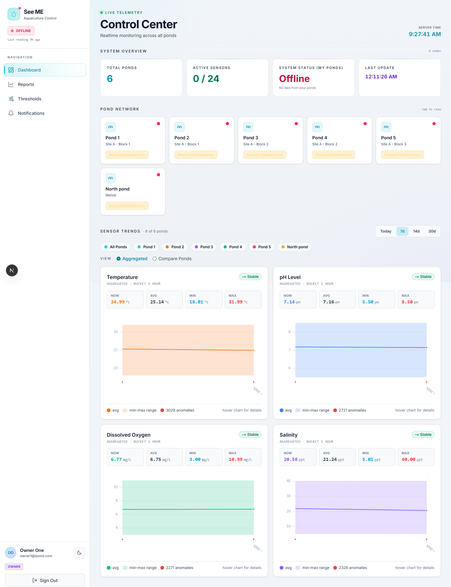

# Owner Manual

**For Pond Owners** — Soletronix iPond, the IoT Aquaculture Monitoring System.

This manual walks every screen and action available to you as a pond owner: from your first login to running an export, requesting maintenance, and tuning the optimal-range alarms. Every section includes a screenshot of the actual page so you can compare what you see to what the manual describes.

> Owners can see only the ponds an administrator has shared with them. If a feature in this manual is missing on your account, contact your administrator to confirm your role and pond assignments.

## Table of Contents

1. [Signing In](#1-signing-in)
2. [Dashboard — Control Center](#2-dashboard--control-center)
3. [Pond Detail View](#3-pond-detail-view)
4. [Single-Sensor Deep Dive](#4-single-sensor-deep-dive)
5. [Reports — PDF and CSV Export](#5-reports--pdf-and-csv-export)
6. [Optimal Range Settings](#6-optimal-range-settings)
7. [Notifications and Maintenance Requests](#7-notifications-and-maintenance-requests)
8. [Light and Dark Themes](#8-light-and-dark-themes)
9. [Troubleshooting](#9-troubleshooting)

---

## 1. Signing In

Open the application URL provided by your administrator. You will land on the **See ME — Aquaculture Control** sign-in page. Enter the email address and password your administrator created for you and press **Sign In →**. The page will redirect to the dashboard on success or show a generic "Invalid email or password" message on failure. Passwords are stored as bcrypt hashes — only your administrator can reset them.

**What you cannot do here**

- Self-register — accounts must be created by an administrator.
- Reset your own password — request a reset through your administrator.
- Sign in with a username — only email addresses are accepted.

---

## 2. Dashboard — Control Center

After login, the dashboard becomes your home screen at `/dashboard`, titled **Control Center**. It contains three areas: a system-overview strip across the top, a **Pond Network** grid of minimal pond cards, and a **Sensor Trends** comparison area below them.

### Left Sidebar

The collapsible sidebar shows the navigation available to owners:

- **Dashboard** — this Control Center page.
- **Reports** — PDF and CSV export centre.
- **Thresholds** — optimal-range configuration.
- **Notifications** — maintenance requests and sensor alerts.

Your name, email, and **OWNER** badge sit at the bottom of the sidebar, above the **Sign Out** button. A small **theme toggle** lives next to your name.

### System Overview Strip

The strip summarizes the health of the ponds you can access:

- **Total Ponds** — count of ponds shared with you in `user_pond_access`.
- **Active Sensors** — sensors reporting in the last minute, as a fraction of expected (4 sensors per pond).
- **System Status (My Ponds)** — **Healthy** when every pond is online, **Degraded** when one or more is stale, **Offline** when nothing has reported recently.
- **Last Update** — wall-clock time of the most recent reading received.

### Pond Network

Every pond you can access appears as a card showing the pond name, location, and a **Request Maintenance** button. A coloured dot in the corner of each card follows the shared `getPondStatus()` rules:

- 🟢 **Green (Online)** — last reading less than 1 minute ago.
- 🟡 **Amber (Stale)** — last reading between 1 and 3 minutes ago.
- 🔴 **Red (Offline)** — no reading in the last 3 minutes.
- 🔵 **Blue (Maintenance)** — an open maintenance request overrides every other colour.

Click anywhere on the card to open the pond's detail page. The hint **"tap to view"** appears above the grid.

### Sensor Trends — Aggregated and Compare

Beneath the cards, the **Sensor Trends** block shows charts for the ponds you have selected. Use the chip row to pick **All Ponds** or specific ponds, the range picker (**Today / 7d / 14d / 30d**) to scope the time window, and the **Aggregated** vs **Compare Ponds** toggle to switch between one averaged line and one line per pond.

---

## 3. Pond Detail View

Each pond has its own page at `/dashboard/{pondId}`. The header repeats the status dot, the pond code (e.g. `PND-001`), and the pond name, followed by three info tiles (**Location**, **Capacity**, **Surface Area**).

Beneath the header is the **Real-Time Sensors** strip with four tiles — **Temperature**, **pH Level**, **Dissolved Oxygen**, **Salinity**. Each tile shows the latest reading rounded to two decimal places, the optimal range for the pond, and the timestamp of the last update. A coloured badge on each tile flags whether the current reading is **OPTIMAL** or in **ALERT**.

A **← Back to Ponds** link in the top-left takes you back to the Control Center.

---

## 4. Single-Sensor Deep Dive

Click any sensor tile on the pond detail page to drill into one sensor at `/dashboard/{pondId}/{sensorType}`. The deep-dive page has four sections:

- **Range picker** — **Today / 7d / 14d / 30d** with a manual refresh button and the "last sync" timestamp.
- **Current Reading** — large tile with the latest value, the optimal range, and the time of last update.
- **Statistics** — Current, Average, Maximum, Minimum across the chosen range, each in its own coloured tile.
- **Trend Analysis** — a chart with optimal-range shading plus **NOW / AVG / MIN / MAX** summary rows.

This is the right view when you are investigating a specific event — for example, why dissolved oxygen dropped overnight, or whether a pH excursion was a sensor glitch or a real water-quality event.

---

## 5. Reports — PDF and CSV Export

The Reports page at `/reports`, labelled **Export Center**, is split into two cards: **Export All Sensors** and **Single Sensor Report**.

### Export All Sensors

The top card exports every sensor for the pond(s) you choose, with all four sensors as columns.

- **Ponds** — choose **All My Ponds** or click **Select Specific** to pick a subset.
- **Date Range** — **Today / Last 7 Days / Last 14 Days / Last 30 Days / Custom**.
- **Download CSV — All Sensors** — one CSV with `timestamp, pond_code, temperature, ph, salinity, dissolved_oxygen`.
- **Download PDF — All Sensors** — a multi-page PDF with a cover page, per-sensor summary tables, and chart images. Both exports are generated client-side with jsPDF, so they download instantly.

### Single Sensor Report

The bottom card produces a focused report on one sensor of one pond. Pick the pond, the sensor (Temperature, pH, Salinity, Dissolved Oxygen), the date range, and click **Load Report Data →**.

---

## 6. Optimal Range Settings

Owners can tune the optimal range per sensor per pond at `/settings/thresholds`, labelled **Optimal Range Settings**.

### Apply To

The top of the page lets you scope the change:

- **Single Pond** — apply to one selected pond.
- **Select Multiple** — apply to several ponds at once.
- **All My Ponds** — apply across every pond you own.

### Per-Sensor Cards

Each sensor (Temperature, pH Level, Salinity, Dissolved Oxygen) has its own card with three fields:

- **Optimal Min** — lower bound of the healthy range.
- **Optimal Value** — optional target value used by the chart as a centre line.
- **Optimal Max** — upper bound of the healthy range.

The **CURRENT** label on the right shows the values currently stored for that sensor. **Save** writes the change immediately and inserts an audit row into `pond_sensor_thresholds_audit`. **Show history** expands a log of past changes for that sensor on that pond.

Changing the optimal range affects two things on the next refresh:

- The **anomaly count** on your charts is recalculated.
- The **alert engine** uses the new range on the next 7-in-a-row check.

| Sensor | Unit | Default Optimal Range | Why It Matters |
|---|---|---|---|
| Temperature | °C | 22.0 to 27.0 | Drives metabolism. Too high reduces dissolved oxygen; too low slows growth. |
| pH | — | 6.5 to 7.5 | Affects ammonia toxicity and nutrient availability. Sudden drops indicate stress. |
| Salinity | ppt | 15.0 to 30.0 | Critical for brackish species. Drift outside range can be lethal. |
| Dissolved Oxygen | mg/L | 5.0 to 8.0 | Below 5 mg/L is dangerous; sustained low DO causes fish kill events. |

---

## 7. Notifications and Maintenance Requests

The bell icon in the sidebar shows the count of unread notifications. Open `/notifications` to see your maintenance request history filterable by **Status** and **Pond**. Resolved requests show a green **RESOLVED** badge; pending ones show **PENDING** until an administrator acts.

### Submitting a Maintenance Request

On any pond card or pond detail page, click **Request Maintenance**. Pick the pond, describe what is wrong, and submit. The pond's status dot turns blue (Maintenance) and the request appears here with status **Pending**. An administrator will acknowledge and resolve it; you will see the resolution note on the same row.

### Sensor Alerts

When seven readings in a row fall outside the optimal range for a sensor, the platform inserts a sensor alert. A popup appears in the bottom-right corner of the screen with an **Acknowledge** button. Acknowledging stops the popup from re-appearing for the same event, but a new alert is raised if seven new out-of-range readings come in afterwards, so silent persistent issues keep surfacing.

---

## 8. Light and Dark Themes

The theme toggle is the small icon next to your name in the sidebar footer. The platform remembers your preference per browser via `next-themes`; on a new device you will need to choose the theme again. Both themes show identical data and identical controls — only the colours change. Dark mode is gentler on the eyes for night-shift monitoring; light mode prints better when you take screenshots for reports.

---

## 9. Troubleshooting

| Symptom | Likely Cause | What To Do |
|---|---|---|
| A pond card shows red (Offline) and no values. | The ESP32 gateway for that pond has not posted in 3+ minutes. | Check power and Wi-Fi at the pond. If still offline, submit a maintenance request. |
| A pond card shows blue (Maintenance) but you didn't request it. | An administrator opened a request on your behalf. | Open `/notifications` to read the request details. |
| Your Control Center is empty after login. | No ponds have been shared with your account yet. | Ask your administrator to add you to `user_pond_access` for the relevant ponds. |
| An alert popup keeps re-appearing. | Seven new out-of-range readings have arrived since you last acknowledged. | Investigate the sensor and the optimal range — the issue is real, not a stuck popup. |
| Saving a threshold returns a validation error. | Optimal Min is not strictly less than Optimal Max. | Adjust the values so `min < max`; the API rejects equal or inverted bounds. |
| The Sign In button does nothing. | Your password was likely reset. | Contact your administrator to confirm and re-issue your password. |

---

*Soletronix iPond — Owner Manual v1.0*
